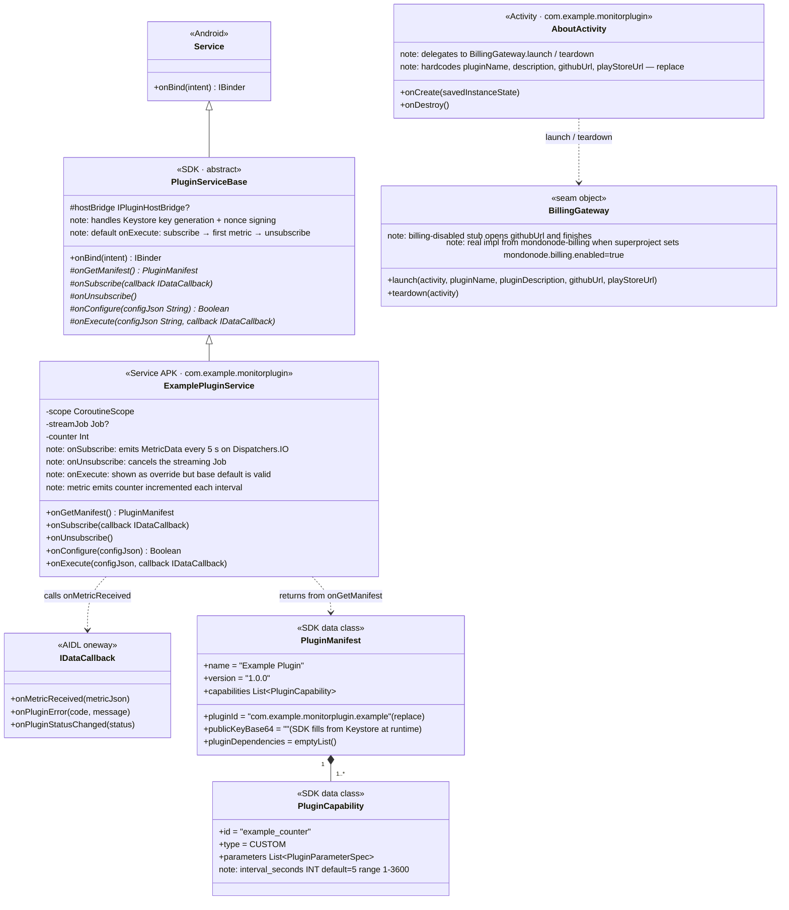

# mondonode-plugin-template — Architecture

Minimal starting point for third-party monitoring plugin authors. One plugin service, one About activity, a billing-disabled stub. No non-SDK dependencies beyond kotlinx.serialization and coroutines. Public git subtree (`plugin-template-origin`).

